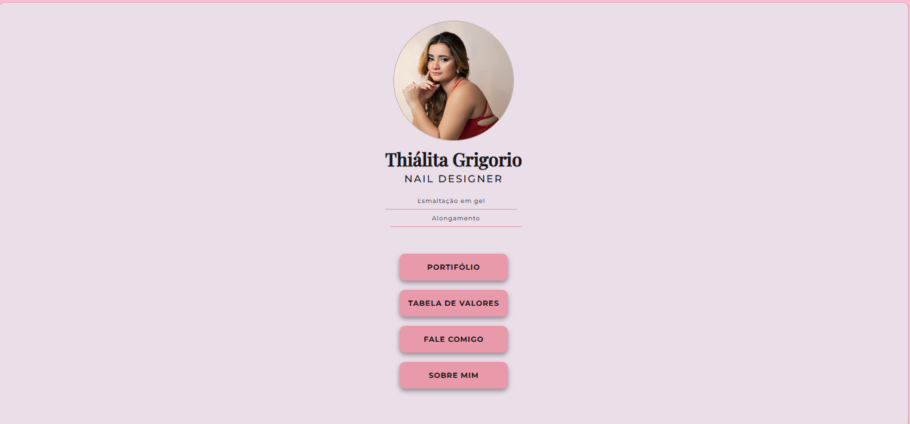

# Thiálita Nails

Site desenvolvido para uma profissional, com o objetivo de apresentar seus serviços e trabalhos de forma moderna e organizada.

## Sobre o projeto

O Thiálita Nails é um projeto prático de desenvolvimento web, criado para oferecer uma experiência visual agradável e facilitar o acesso às informações.

## Tecnologias utilizadas

- HTML5
- CSS3
- JavaScript
- React

## Funcionalidades

- Apresentação dos serviços.
- Galeria de trabalhos.
- Navegação entre as seções.
- Acesso às informações de contato.

## Acesse o projeto

- **Site:** https://www.thialitanaildesigner.com.br
- **Repositório:** https://github.com/tawanegrigorio/site-nail-designer

 ## Prévia do projeto

Este projeto faz parte da minha evolução em desenvolvimento Front-End, permitindo praticar a criação de interfaces, a organização de componentes e a construção de páginas para um negócio real.
